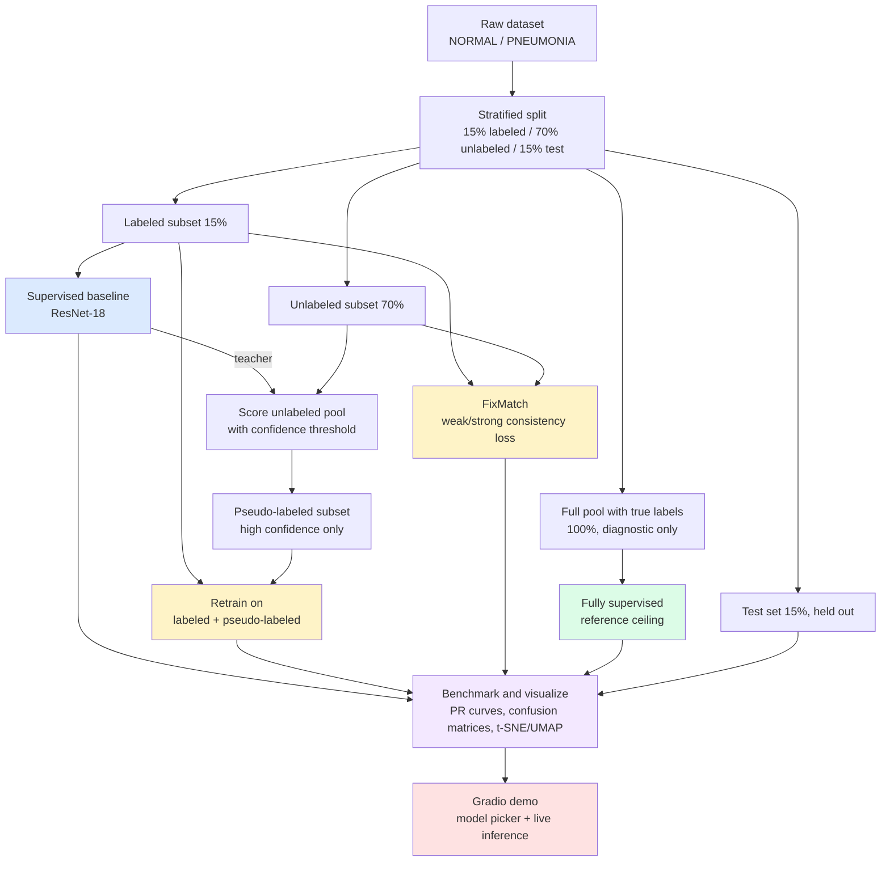

# Semi-Supervised Medical Image Classification via Pseudo-Labeling & FixMatch

Training a good image classifier usually assumes you have thousands of labeled examples. In medical imaging that assumption falls apart fast: labeling a chest X-ray takes a radiologist's time, and that time is expensive. This project looks at a more realistic question. How much of that labeling cost can you claw back by using techniques that squeeze signal out of unlabeled data instead?

It builds a semi-supervised learning pipeline that trains on 15% labeled data plus a much larger pool of unlabeled data, and compares two approaches to doing that, pseudo-labeling and FixMatch, against a plain supervised baseline trained on that same small labeled slice.

## What's here

- A data pipeline that splits a dataset into 15% labeled, 70% unlabeled, and 15% held-out test data, with stratified sampling so class balance holds across all three
- A supervised ResNet-18 baseline trained only on the labeled slice
- A pseudo-labeling / self-training loop: train a teacher on the labeled data, score the unlabeled pool, keep only confident predictions, retrain on the combined set
- A FixMatch implementation using weak and strong augmentation with a confidence-masked consistency loss
- A fully supervised reference model trained on 100% of the data, used as a ceiling to measure how much of the gap the SSL techniques actually close
- Benchmarking scripts: precision-recall curves, confusion matrices, and t-SNE/UMAP feature embedding comparisons
- A hyperparameter ablation runner
- A Gradio demo where you can upload an X-ray and compare predictions across all four trained models

## Why this setup

Supervised learning is label-hungry, and in domains like medical imaging every label costs an expert's time. That caps how much labeled data any team can realistically gather. Unlabeled images, on the other hand, tend to be cheap and plentiful (raw scans sitting in an archive, for example).

Semi-supervised learning tries to close that gap. Bootstrap a model on a small labeled set, then use that model, combined with some regularization trick, to pull additional training signal out of a much larger unlabeled pool.

This project compares four points on that spectrum:

1. **Supervised baseline.** Train on the 15% labeled slice only. This is the realistic floor for a team that can't afford more annotation.
2. **Pseudo-labeling.** Use the baseline as a teacher, label the unlabeled pool, keep only high-confidence predictions, and retrain a student on labeled plus pseudo-labeled data.
3. **FixMatch.** Instead of committing to pseudo-labels once, regenerate them every batch from a weakly augmented view, and require the model to reproduce that same prediction on a strongly (heavily) augmented view of the same image.
4. **Fully supervised ceiling.** Train on all the data with real labels, just to see how much performance was actually on the table.

The interesting question isn't just "does SSL help." It's which technique holds up better when the labeling budget is small and the teacher model itself is far from perfect, and how much of the gap to full supervision it manages to close.

## Dataset

**Chest X-Ray Images (Pneumonia)**, from Kaggle (`paultimothymooney/chest-xray-pneumonia`).

Binary classification, NORMAL vs. PNEUMONIA, roughly 5,800 images total, with a natural class imbalance (about 73% pneumonia). It's a widely recognized medical imaging benchmark, small enough to iterate on quickly, and large enough that a 15% labeled slice still means a few hundred images rather than a toy split.

The dataset's default train/val/test folders get merged and re-split by this project's own pipeline, so the labeled/unlabeled/test proportions are controlled directly rather than inherited from the original split.

## How the training loss works

For the pseudo-labeling stage, a confidence threshold (default 0.95) decides which of the teacher's predictions get treated as labels.

For FixMatch, the loss combines a normal supervised term with a masked consistency term:

```
loss = CE(labeled)  +  lambda_u * mean( CE(strong_view, pseudo_label) * mask )
```

where the pseudo-label comes from the weakly augmented view (no gradient), and the mask zeroes out any sample whose confidence falls below the threshold. The strong view has to reproduce that label anyway, which is a stricter bar than a static confidence cutoff alone, since the model has to survive real distortion and not just agree with itself.

## Architecture



Blue is the supervised baseline, yellow the SSL techniques, green the reference ceiling, purple evaluation, red deployment. GitHub renders this diagram natively. If you want a standalone image, paste the source into [Mermaid Live Editor](https://mermaid.live) and export a PNG or SVG.

## Repository structure

```
ssl_project/
├── README.md
├── README_day1.md      data prep & baseline, detailed run guide
├── README_day2.md      pseudo-labeling, detailed run guide
├── README_day3.md      FixMatch, detailed run guide
├── README_day4.md      benchmarking & visualization, detailed run guide
├── README_day5.md      demo deployment & ablation, detailed run guide
├── requirements.txt
├── src/
│   ├── utils.py                   seeding, metrics, early stopping
│   ├── dataset.py                 manifest-based image Dataset + transforms
│   ├── prepare_data.py            builds the 15/70/15 stratified split
│   ├── train_baseline.py          supervised baseline (ResNet-18)
│   ├── generate_pseudo_labels.py  teacher inference + confidence filter
│   ├── analyze_pseudo_labels.py   threshold sweep diagnostic
│   ├── train_pseudolabel.py       retrain on labeled + pseudo-labeled
│   ├── augmentations.py           weak/strong augmentation pipelines
│   ├── dataset_fixmatch.py        dual-view unlabeled dataset
│   ├── train_fixmatch.py          FixMatch training loop
│   ├── train_full_supervised.py   100%-labeled reference ceiling
│   ├── benchmark.py               aggregate metrics into a comparison table + chart
│   ├── plot_pr_confusion.py       precision-recall curves + confusion matrices
│   ├── plot_embeddings.py         t-SNE/UMAP feature embedding comparison
│   ├── app.py                     Gradio interactive demo
│   └── run_ablation.py            hyperparameter ablation sweep runner
└── outputs/
    ├── manifests/       CSV manifests for each split (generated)
    ├── checkpoints/     saved model weights (generated)
    ├── figures/         diagnostic plots (generated)
    └── comparison_table.csv   aggregated benchmark results (generated)
```

## Getting started

You'll need a GPU for reasonable training speed. Google Colab's free T4 tier works fine, and Kaggle Notebooks is convenient since the dataset is already hosted there.

```bash
pip install -r requirements.txt

# 1. Data prep and baseline
python src/prepare_data.py --data_root data/raw --out_dir outputs/manifests \
    --labeled_frac 0.15 --test_frac 0.15 --seed 42
python src/train_baseline.py --manifest_dir outputs/manifests --epochs 15

# 2. Pseudo-labeling
python src/generate_pseudo_labels.py --manifest_dir outputs/manifests \
    --ckpt_path outputs/checkpoints/baseline_best.pt --threshold 0.95
python src/train_pseudolabel.py --manifest_dir outputs/manifests --epochs 15

# 3. FixMatch
python src/train_fixmatch.py --manifest_dir outputs/manifests --epochs 15 \
    --batch_size_labeled 16 --mu 3 --threshold 0.95 --lambda_u 1.0

# 4. Fully supervised ceiling and benchmarking
python src/train_full_supervised.py --manifest_dir outputs/manifests --epochs 15
python src/benchmark.py --outputs_dir outputs
python src/plot_pr_confusion.py --manifest_dir outputs/manifests
python src/plot_embeddings.py --manifest_dir outputs/manifests \
    --model_a_ckpt outputs/checkpoints/baseline_best.pt --model_a_label "Baseline (15%)" \
    --model_b_ckpt outputs/checkpoints/fixmatch_best.pt --model_b_label "FixMatch" \
    --method tsne

# 5. Demo
python src/app.py --ckpt_dir outputs/checkpoints
```

Each training script writes its own `metrics_*.json` to `outputs/`. `benchmark.py` pulls all of them together into a comparison table and chart, and also prints a markdown table you can drop straight into a writeup.

See the per-day READMEs for the full detail, troubleshooting notes, and what to watch for at each stage (things like the pseudo-label accuracy vs. coverage tradeoff, or FixMatch's mask rate during training).

## Interactive demo

`src/app.py` runs a small Gradio app. Upload a chest X-ray, pick a model from the dropdown, see the predicted class and confidence. The dropdown is really the point of the demo: switching between the 15%-labeled baseline and an SSL-trained model on the same image makes the effect of the unlabeled data visible instead of abstract.

```bash
python src/app.py --ckpt_dir outputs/checkpoints
```

`README_day5.md` covers deploying it publicly to Hugging Face Spaces if you want a shareable link.

## Ablation study

`src/run_ablation.py` sweeps a chosen hyperparameter, retraining at each value and aggregating the results. Two sweeps are built in: the pseudo-labeling confidence threshold, and FixMatch's consistency loss weight (`lambda_u`). This is what justifies the project's default choices instead of just asserting them.

```bash
python src/run_ablation.py --sweep pseudolabel_threshold \
    --values 0.8 0.9 0.95 0.99 --manifest_dir outputs/manifests --epochs 8

python src/run_ablation.py --sweep fixmatch_lambda_u \
    --values 0.25 0.5 1.0 2.0 --manifest_dir outputs/manifests --epochs 8
```

## Tech stack

- Model: ResNet-18, ImageNet-pretrained backbone, fine-tuned
- Framework: PyTorch and torchvision
- Augmentation: torchvision's RandAugment and RandomErasing
- Evaluation: scikit-learn (accuracy, F1, precision, recall, confusion matrix, PR curves), matplotlib for plots
- Feature visualization: scikit-learn t-SNE / UMAP on penultimate-layer embeddings
- Demo: Gradio, deployable to Hugging Face Spaces

## Limitations

Results here reflect a single train/val/test split and a single random seed. A more rigorous evaluation would average over several seeds and report variance instead of a point estimate.

The confidence threshold (0.95) and FixMatch's `lambda_u`/`mu` values are common defaults from the literature, not the result of an exhaustive search. The ablation runner exists to interrogate these choices, but hasn't been run across a full hyperparameter grid.

This was trained on a single public dataset with a known class imbalance. Conclusions about how well SSL works here shouldn't be assumed to carry over to other medical imaging tasks without re-checking.

## Possible extensions

- MixMatch or Mean Teacher as additional SSL baselines to compare against FixMatch
- A multi-seed evaluation to report variance rather than a single number
- A second domain, like financial document classification, to see how well these findings generalize outside medical imaging